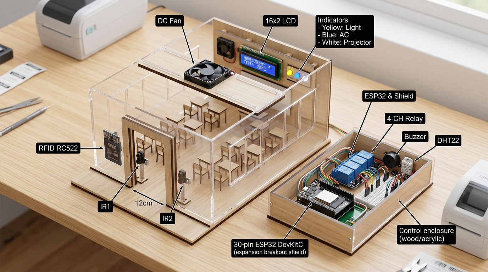
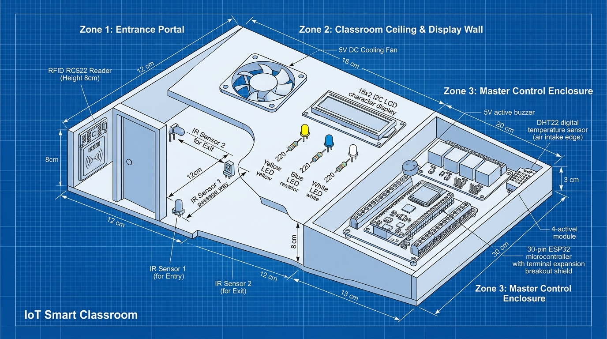
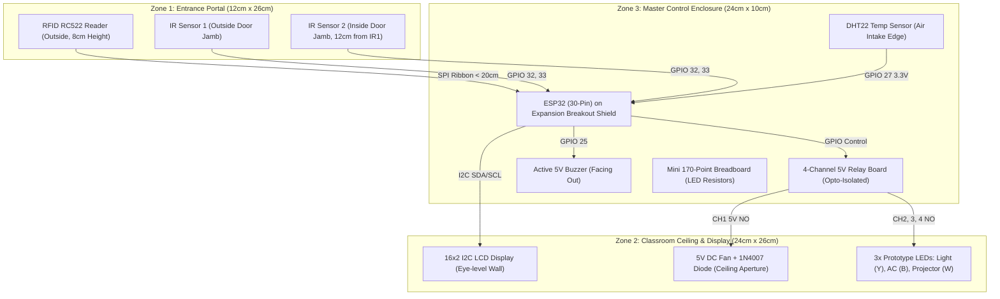

# 📐 Smart Classroom Management System — 3D Prototype Design & Spatial Placement Guide

**Team 06 — CSE 315 / 316 (University of Asia Pacific)**  
*ESP32 DevKit V1 (30-Pin) + Sensors + Actuators Physical Architecture*

---

## 📸 3D Physical Prototype Visualizations

### 1. Realistic Isometric 3D Prototype Model

### 2. Technical 3D Blueprint & Dimensional Layout

---

## 🌐 Interactive 3D Web Prototype Viewer
You can view, rotate in 360°, inspect wire traces, and click every single component interactively in your browser:
* Open in browser: [`3d_prototype_viewer/index.html`](file:///d:/Study/3.2/CSE-315/Project/simulation/3d_prototype_viewer/index.html)

---

## 🏛️ Spatial Architecture & Zone Division

To achieve **maximum efficiency, zero sensor interference, and ultra-reliable demonstration**, the entire physical build is divided into **three functional zones**:

---

## 📍 Exact Placement Rationale & Component Specifications

| # | Component | Zone | Physical Coordinates / Position | Why This Position is Most Efficient |
|---|-----------|:----:|---------------------------------|--------------------------------------|
| **1** | **MFRC522 RFID Reader** | **Zone 1** | Mounted vertically on the **exterior door frame** at 8–10 cm height. | Ergonomic card tap before crossing the door threshold. Ensures student/teacher cards are read **before** triggering the entry IR beam. |
| **2** | **IR Sensor 1 (Entry)** | **Zone 1** | Outer door jamb, 3.5 cm above floor, pointed horizontally across the doorway. | First beam broken during entry; second beam broken during exit. Must be 12–15 cm away from IR2. |
| **3** | **IR Sensor 2 (Exit)** | **Zone 1** | Inner door jamb, 3.5 cm above floor, pointed horizontally across the doorway. | Completes direction logic (`IR1 → IR2` = Enter +1; `IR2 → IR1` = Exit -1). Enables **Contactless Free Exit**. |
| **4** | **16×2 I2C LCD** | **Zone 2** | Front wall / top bezel at eye-level. | Prominently visible to audience and faculty during presentation. Displays room headcount, temp, and live swipe alerts. |
| **5** | **5V DC Cooling Fan** | **Zone 2** | Centered in the classroom ceiling cutout pointing down. | Visibly rotates when temperature ≥ 27.0°C and occupants are present. Mounted overhead to avoid interfering with door sensors. |
| **6** | **3× Status LEDs** | **Zone 2 / 3** | Mounted in a clean row (Yellow, Blue, White) on the mini breadboard. | Immediate visual confirmation for: **Yellow** = Room Light, **Blue** = AC, **White** = Smart Projector. |
| **7** | **ESP32 30-Pin + Shield** | **Zone 3** | Centered in the control enclosure, antenna facing outward. | Heart of the system. Shield gives dedicated 3.3V, 5V, and GND rails for every GPIO, eliminating wire clutter. |
| **8** | **4-Channel 5V Relay** | **Zone 3** | Adjacent to the ESP32 shield, separated by 3 cm. | Isolates inductive loads and high currents from the low-voltage ESP32 logic. |
| **9** | **DHT22 Temperature Sensor** | **Zone 3** | Outer edge of the enclosure near airflow ventilation. | **Thermal Isolation**: Placing it away from warm relay coils and the ESP32 ensures true ambient room temperature readings. |
| **10** | **5V Active Buzzer** | **Zone 3** | Top corner of the control box with sound hole facing out. | Loud, crisp acoustic feedback on card scans (short beep) and unauthorized intrusion attempts (continuous alarm). |

---

## ⚡ 4 Critical Engineering Rules for Maximum Stability

### 1. Distance Between IR Sensors (12 cm – 15 cm)
* **Why:** If IR1 and IR2 are placed too close (< 5 cm), a passing hand or person can trigger both sensors simultaneously, causing the microcontroller to miss the sequential direction order.
* **Optimal:** Exactly **12 cm** apart ensures unambiguous state detection: `IR1 LOW` $\rightarrow$ `IR2 LOW` $\rightarrow$ `IR1 HIGH` $\rightarrow$ `IR2 HIGH`.

### 2. SPI Ribbon Cable Length (< 20 cm)
* **Why:** The MFRC522 RFID reader communicates via high-speed SPI bus (13.56 MHz carrier). If jumper wires exceed 25–30 cm, capacitance and cross-talk cause `MFRC522: communication check failed` errors.
* **Rule:** Route the SPI jumper wires directly from the ESP32 expansion board through the baseboard side channel to the door frame without looping.

### 3. Thermal Isolation of DHT22
* **Why:** The ESP32 processor and 4 relay coils generate subtle heat during continuous operation (~2–4°C rise inside a closed box).
* **Rule:** Mount the DHT22 on the exterior periphery or near an air intake slot, NEVER directly above or next to the relay coils.

### 4. 1N4007 Flyback Diode Across Fan Terminals
* **Why:** When Relay Channel 1 cuts power to the rotating DC fan, the collapsing magnetic field in the motor creates a reverse inductive voltage spike of up to 50V–100V. This kickback causes instant ESP32 reboot loops.
* **Rule:** Fasten the **1N4007 diode directly across the fan motor terminals** (Cathode silver band to Fan `+`, Anode to Fan `-`).
